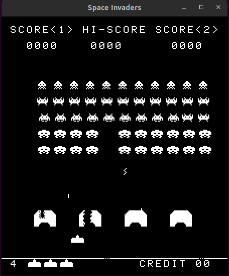

# Zinvaders

A Space Invaders Arcade Emulator written in Rust.



## Features

- Full Intel 8080 CPU emulation
- Display rendering with correct arcade orientation
- Keyboard input support for 2 players
- Sound effects (all 9 classic Space Invaders sounds)
- Interrupt handling for game timing

## Controls

- **Arrow Keys / A/D**: Move left/right (Player 1)
- **Space / W**: Fire (Player 1)
- **J/L**: Move left/right (Player 2)
- **I**: Fire (Player 2)
- **1**: Start 1 Player Game
- **2**: Start 2 Player Game
- **3**: Insert Coin
- **T**: Tilt (cheat detection)
- **ESC**: Quit

## Building and Running

```bash
cargo build --release
cargo run --release -- <path_to_rom>
```

## Sound

The emulator includes all 9 classic Space Invaders sound effects:
- UFO flying sound (looping)
- Player shot
- Player explosion
- Invader explosion
- Extended play (extra ship)
- Fleet movement sounds (4 descending tones)
- UFO hit

Sound is implemented using simple synthesized square waves and frequency sweeps to approximate the original arcade sounds.

## ROM Files

You will need to provide your own Space Invaders ROM files. The ROM should be placed in a location you specify when running the emulator. The emulator also supports CP/M .COM test files (like TST8080.COM) for CPU testing purposes.

If you have 4 separate files for the ROM, you must merge them in the correct order by running:

```bash
cat invaders.h invaders.g invaders.f invaders.e > invaders.rom
```

**Note**: Space Invaders ROM files are copyrighted and cannot be legally distributed with this emulator. You must obtain them from legal sources.